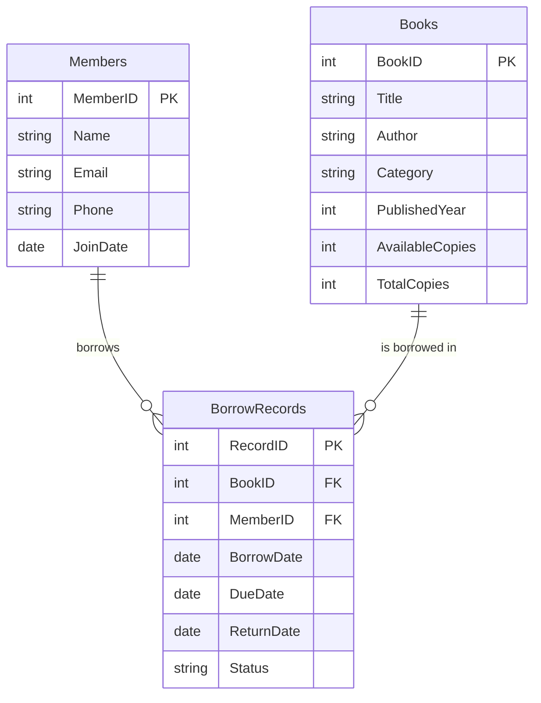

# Library Management System - Project Report

## 1. Problem Description and Assumptions
The objective of this project is to build a functional, database-backed Library Management System. 
The system allows a library to manage books, register members, and track the borrowing and returning of books. 
The system ensures that books cannot be borrowed if there are no available copies, and tracks the due dates for returns.

**Assumptions:**
- A member can borrow multiple books.
- Each book title is unique to its `BookID`, but a library can hold multiple copies (tracked via `TotalCopies` and `AvailableCopies`).
- The system currently does not calculate late fees for overdue books, but it tracks the due date.

## 2. Conceptual Design (ER Modeling)

### Entities & Attributes
1. **Books**: `BookID` (PK), `Title`, `Author`, `Category`, `PublishedYear`, `AvailableCopies`, `TotalCopies`
2. **Members**: `MemberID` (PK), `Name`, `Email`, `Phone`, `JoinDate`
3. **BorrowRecords**: `RecordID` (PK), `BorrowDate`, `DueDate`, `ReturnDate`, `Status`

### Relationships
- A Member **Borrows** Books.
- A Book **Is Borrowed By** Members.
- This represents an M:N (Many-to-Many) relationship between Members and Books. We resolve this in the relational schema using an associative entity, **BorrowRecords**.
- **Cardinality:** 1 Member relates to 0 or many BorrowRecords. 1 Book relates to 0 or many BorrowRecords.

### ER Diagram (Mermaid)

## 3. Relational Schema & Constraints Identification

The ER model maps directly to the following 3 tables with specific constraints:

1. **Domain Constraints:** 
   - `PublishedYear` must be between 1000 and 2100.
   - `Status` in `BorrowRecords` must be one of `('Borrowed', 'Returned', 'Overdue')`.
2. **Key Constraints:** 
   - `BookID`, `MemberID`, and `RecordID` act as unique identifiers (Primary Keys).
   - `Email` in the `Members` table is constrained to be `UNIQUE` to prevent duplicate registrations.
3. **Entity Integrity:** 
   - All Primary Keys (`BookID`, `MemberID`, `RecordID`) are auto-incrementing integers and implicitly enforced as `NOT NULL`.
4. **Referential Integrity:** 
   - `BorrowRecords.BookID` is a Foreign Key referencing `Books.BookID` (`ON DELETE CASCADE`).
   - `BorrowRecords.MemberID` is a Foreign Key referencing `Members.MemberID` (`ON DELETE CASCADE`).
5. **Semantic Constraints:**
   - `AvailableCopies` cannot be negative (`CHECK AvailableCopies >= 0`).
   - `AvailableCopies` cannot exceed `TotalCopies` (`CHECK AvailableCopies <= TotalCopies`).
   - Inside `BorrowRecords`, `ReturnDate` cannot be earlier than `BorrowDate` (`CHECK ReturnDate >= BorrowDate`).

## 4. Front-End Interface
The front-end is constructed as a Single Page Application (SPA) using HTML, Vanilla CSS, and JavaScript.

**Features include:**
- **Navigation:** A sidebar to quickly switch between the Dashboard, Manage Books, Manage Members, and Issue/Return views.
- **Theming:** A built-in Dark/Light mode toggle, utilizing CSS variables (custom properties) and saving user preference in LocalStorage.
- **Data Insertion:** Modals containing forms allow the librarian to add new Books, add new Members, and Issue books.
- **Data Retrieval & Modification:** Data is fetched directly from the Node.js/Express backend API and rendered into data tables dynamically. A "Return" button on active borrows triggers an API PUT request, which simultaneously updates the borrow status and increments the available copies of the book within a SQL Transaction.

## 5. How to Run Demo locally
1. Ensure MySQL is running locally.
2. Execute `schema.sql` in MySQL to create the database, tables, and populate sample data.
3. Update `backend/db.js` with your local MySQL credentials (`root` / empty password by default).
4. Navigate to `backend` directory and run `npm install`, then `node server.js`.
5. Open `http://localhost:3000` in the browser.
